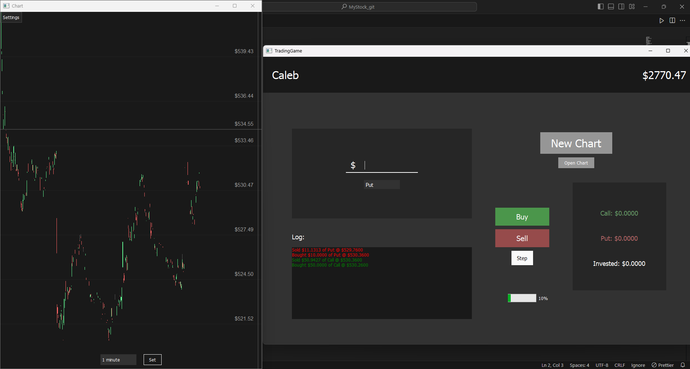
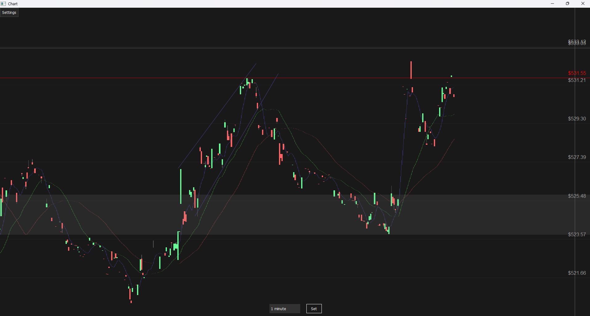

# Paper Trading Game
## This application is a fully developed paper trading game from scratch that allows you to trade at all hours of the day by grabbing historical data. It uses a mongodb to store data, that way the user can keep track of their progress, and also monitor their friends progress. Everything was made from scratch including the graph window.
###   - The UI is made using PyQt5
###   - The graph itself was made from grabbing historical stock data from Yahoo Finance, and then using pillow to create an image from that data.
###   - MongoDB was used to store the data, and I used pymongo to access the database

## 
###   - The main file is the main window.
###   - Implementation of functions:
###       - Buying and selling stock
###       - Call/put
###       - Logging in and updating balance
###       - Initializing random tickers and dates
###       - Creating and closing graph windows

## 
###   - The Custom Widgets file has all of the necessary functions to create the graph, and display it on a custom window.
###   - A custom cursor that allows the user to maneuver the graph, and access the parts that it desires.
###   - 3 Indicators (7 day, 30 day, 60 day Moving averages)
###   - Access to different time intervals (1m, 5m, 30m, etc.)
###   - Tools to draw price lines, supply/demand zones, and diagonal lines.
## 
###   - The grab.py file contains all of the methods for grabbing data from Yahoo Finance including specific periods, intervals, and dates
## 
###   - The admin file allows me to create users, reset users, and plot user's balance history
